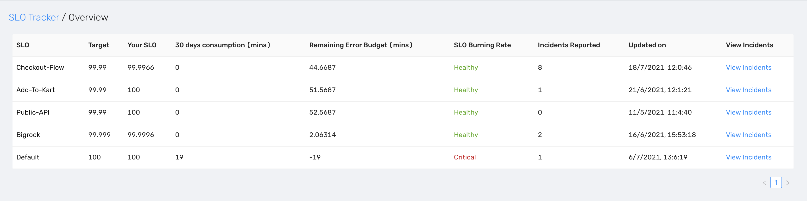
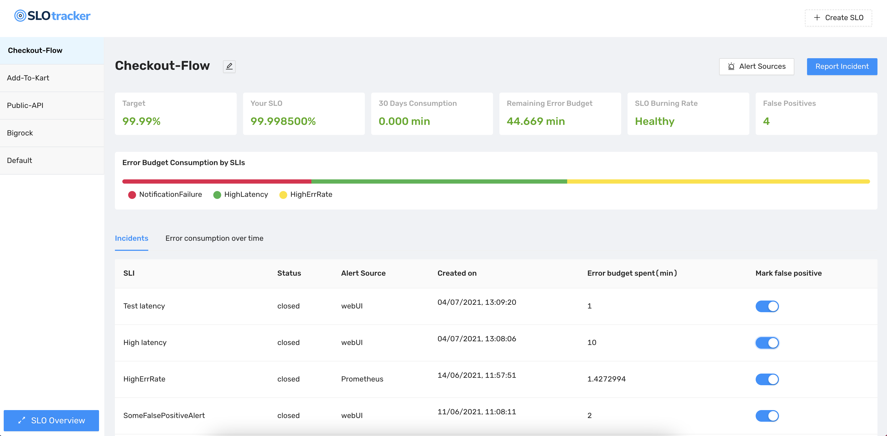

## SLO-Tracker  
A simple but effective way to track SLO's and Error budgets. `SLO-tracker` can be integrated with few alerting tools via webhook integration to receive SLO violating incidents. 

### Motivation
SLOs are a predefined approach to defining the amount of downtime that is acceptable for your product. Tracking SLO's and error budgets can be hard without proper tooling support because of the multitude of alert sources. 

Since SLO's are directly related to the user experience of the product, more and more companies are [defining their SLO's](https://cloud.google.com/blog/products/devops-sre/availability-part-deux-cre-life-lessons) and tracking the error budget. Even though most monitoring tools provide SLO tracking feature out of the box, SREs don't find it to be a wholesome solution. This is because SREs might have different tools for monitoring different services and their respective [SLIs](https://newrelic.com/blog/best-practices/best-practices-for-setting-slos-and-slis-for-modern-complex-systems). 

In the event of an incident, manually aggregating these SLIs from multiple tools and placing it in one place to track error budgets is very challenging. Sometimes self-hosted monitoring tools might have short retention policies, thus making it hard to retain SLO metrics for longer durations(>6 months). And the most challenging situation is when false positive alerts reduce your error budget and you're grappling to gain valuable minutes into your error budget. 

### Highlights
- Provides a unified dashboard for all the SLOs that have been set up, in turn giving insights into the SLIs being tracked
- Provides the ability to claim your falsely spent Error Budget back by marking erroneous SLO violation alerts as False Positives
- Supports manual alert creation from the web app when a violation not caught by alert sources (or not supported alert-sources)
- Displays basic Analytics for SLO violation distribution (SLI distribution graph, Error budget consumption over time)
- Easy to set up, lightweight since it only stores and computes what matters (SLO violation alerts) and not the bulk of the data (every single metric) 

### Installation and usage
```sh    
docker-compose up --build -d      
```    
> `admin:admin` is the default creds for UI, Which can be changed in docker-compose file.

### Supported integrations
- Prometheus
- Datadog
- Newrelic
- Pingdom
- Grafana
- SLO-Tracker API  

#### P.S: Sending all the alerts `SLO-tracker` from your monitoring tool defeats the purpose. Please send only SLO violating incidents to this tool.   
 
### UI Screenshots
 

**Demo dashboard:** http://demo.slotracker.com:3000/   (creds: admin:admin)   
**Blog:** https://dev.to/squadcast/introducing-our-open-source-slo-tracker-a-simple-tool-to-track-slos-and-error-budget-4dp

### Contributing

Refer to [CONTRIBUTING.md](https://github.com/roshan8/slo-tracker/blob/main/CONTRIBUTING.md)


## Stargazers over time

[](https://starchart.cc/roshan8/slo-tracker)

